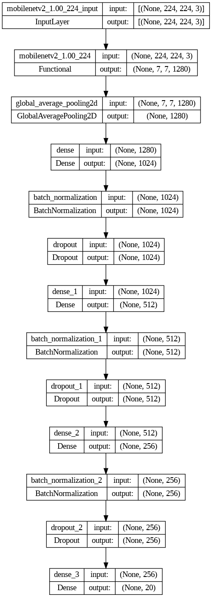

# ASING! - Machine Learning Team (C241-PS157)

## Project Overview

This project aims to classify food into categories deemed worthy or unworthy of consumption for pregnant women, with the overarching goal of reducing stunting rates in Indonesia. Utilizing Convolutional Neural Network (CNN) architecture and TensorFlow, 
our model can detect and provide recommendations on the suitability of food for pregnant women based on images. Additionally, for recommended foods, the result will display nutritional information such as calories, fat, and protein content.


## Table of Contents

- [Project Overview](#project-overview)
- [Dataset](#dataset)
- [Data Preprocessing](#data-preprocessing)
- [Model Architecture](#model-architecture)
- [Training](#training)
- [Model Conversion](#model-conversion)
- [Usage](#usage)
- [Contributors](#contributors)

## Dataset

The dataset used in this project is obtained from [this source](https://storage.googleapis.com/dataset-dragon-frost/New_Asing_Classification.zip). It contains food images categorized as suitable or not suitable for pregnant women.

- **Training Data**: `train` directory
- **Validation Data**: `valid` directory
- **Test Data**: `test` directory (moved to validation during preprocessing)

## Data Preprocessing

The dataset used for the Food Classification model consists of images categorized as suitable or not suitable for consumption by pregnant women. The dataset includes a variety of food items (20 Class) commonly consumed by pregnant women.

Data augmentation techniques are applied to enhance the dataset's diversity and size. The ImageDataGenerator class from TensorFlow is used for rescaling, rotation, zooming, flipping, shifting, shearing, and adjusting the brightness of the images. This helps improve the model's ability to generalize and make accurate predictions.
The preprocessing steps include:

- Resizing images to 224x224 pixels.
- Converting images to grayscale.
- Normalizing pixel values.
- Applying various augmentations such as random brightness, contrast, saturation, hue adjustments, flipping, rotation, and zooming.

## Model Architecture


Sandler, M., Howard, A., Zhu, M., Zhmoginov, A., & Chen, L.-C. (2018). MobileNetV2: Inverted Residuals and Linear Bottlenecks. In *Proceedings of the IEEE Conference on Computer Vision and Pattern Recognition* (pp. 4510-4520).

The model is built using the MobileNetV2 architecture with pre-trained weights from ImageNet. The architecture includes:

- A base model from MobileNetV2 with the top layers removed.
- Additional dense layers for feature extraction.
- Batch normalization and dropout layers to reduce overfitting.
- An output layer with a softmax activation function for classification.



## Training

The model is trained using:

- **Optimizer**: Adam with a learning rate of 0.001.
- **Loss Function**: Sparse Categorical Crossentropy.
- **Metrics**: Accuracy.

The training process includes callbacks for:

- Saving the best model.
- Early stopping if the validation accuracy does not improve.
- Reducing the learning rate when the validation loss plateaus.

## Model Conversion

The trained model is converted to TensorFlow.js format to integrate the model with our Android application using an API. This decision was made to reduce the device's load and minimize performance impact. The steps include:

- Saving the Keras model in TensorFlow SavedModel(h5) format.
- Converting the SavedModel to TensorFlow.js format.
- Compressing the TensorFlow.js model folder for easy download.

## Usage

To use the model, follow these steps:

1. **Clone the repository**.
   ```sh
   git clone https://github.com/rifialdiif/ASING-.git
2. **Install the required dependencies** in your Google Colab/Jupyter Notebook.
   ```sh
    pip install tensorflow pandas numpy opencv-python matplotlib
3. **Navigate to the Notebooks** directory within the cloned repository and open the notebook files.
4. **Execute the code cells** within the notebooks to train the machine learning model and assess its performance.
5. **Save the trained model as model.h5** for future reference and use.
6. **Convert the trained model to the TensorFlow JS (TF.js)** format using the provided code and save it as tfjs_model.zip.

## Authors

- [Rifiadi Faturrochman](https://github.com/rifialdiif)
- [Reisa Aulia Sodikin](https://github.com/reisaaulia)
- [M. Fadhillah Nursyawal](https://github.com/reisaaulia)

## Contributing
Feel free to contribute to this project by submitting your ideas, suggestions, or improvements through a pull request. Please ensure that your contributions relevant for this project.

## Acknowledgments
This project is part of the Bangkit Academy 2024 capstone project by Team C241-PS157. Special thanks to our advisors especially Mr. Kasmir Syariati & Mrs. Cynthia Cecilia  for their guidance and support.
